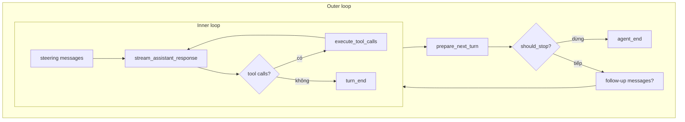

# Agent Loop

Orchestrate multi-turn agent: gọi LLM → chạy tool → lặp cho đến khi dừng. **Stateless** — caller (thường là harness) tự giữ context và session.

← [Agent (overview)](../README.md) · Stateful shell: [harness](../harness/README.md)

## Vị trí trong stack

```
AgentHarness.prompt()
       │
       ▼
  agent_loop              ← turn loop, tools, events
       │
       ├── streaming.py  → ai.stream_simple (mặc định)
       └── tools.py       → AgentTool.execute
```

Types/events nằm ở `agent/types.py`, `agent/events.py` — folder này chỉ chứa logic chạy.

## Inner vs outer loop



- **Inner:** stream → tool → stream … cho đến hết tool call (hoặc batch `terminate`)
- **Outer:** sau inner xong, drain follow-up queue → chạy inner lại

## Luồng một lần chạy

```
run_agent_loop(prompts, context, config)
       │
       ▼
  run_loop
       ├─ steering messages (inject giữa turn)
       ├─ stream_assistant_response  → LLM, emit message_*
       ├─ execute_tool_calls         → sequential hoặc parallel
       ├─ prepare_next_turn          → refresh context/model (harness: sync session)
       ├─ should_stop_after_turn     → dừng sớm?
       └─ follow-up messages         → outer loop
       │
       ▼
  AgentEndEvent → trả list message mới
```

## Thành phần

| File | Vai trò |
|------|---------|
| **`runner.py`** | `run_agent_loop`, `run_loop`, `agent_loop` / `agent_loop_continue` |
| **`streaming.py`** | Map context → gọi `stream_fn`, forward LLM events |
| **`tools.py`** | Prepare/validate/execute tool, hooks before/after |
| **`utils.py`** | `emit`, steering/follow-up helpers |

## API

| Hàm | Dùng khi |
|-----|----------|
| **`run_agent_loop`** | Có prompt mới; append vào context rồi chạy |
| **`run_agent_loop_continue`** | Context đã có messages; tiếp tục (last ≠ assistant) |
| **`agent_loop` / `agent_loop_continue`** | Wrapper trả `AgentEventStream` (async iterate + `.result()`) |

Harness gọi trực tiếp `run_agent_loop` + event sink riêng — không qua `AgentEventStream`.

## Config & hooks

`AgentLoopConfig` = stream options + `model` + callbacks:

| Callback | Vai trò |
|----------|---------|
| **`stream_fn`** | Inject LLM (harness → `stream_simple`) |
| **`transform_context`** | Chỉnh messages trước LLM (harness: microcompact) |
| **`convert_to_llm`** | Map agent messages → format provider |
| **`before_tool_call` / `after_tool_call`** | Block hoặc patch tool result |
| **`prepare_next_turn`** | Đổi context/model sau mỗi turn (harness rebuild TurnState) |
| **`get_steering_messages` / `get_follow_up_messages`** | Queue inject message |
| **`should_stop_after_turn`** | Dừng loop sớm |

## Events

Loop emit `AgentEvent`: `agent_start/end`, `turn_start/end`, `message_*`, `tool_execution_*`.

Harness lắng nghe và map sang session write + hook riêng — xem [harness/README.md](../harness/README.md).
