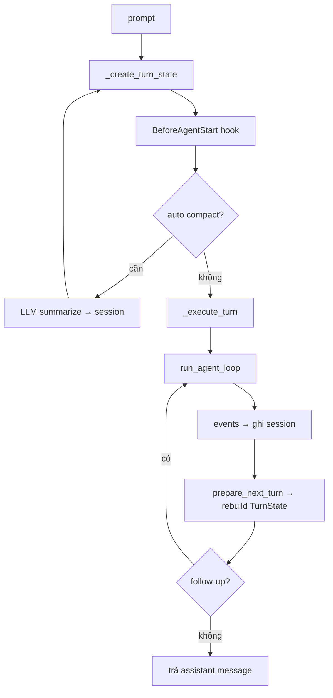

# Harness

Lớp agent **stateful**: một `AgentHarness` gắn session, model, tools, hooks, compaction và các queue điều khiển turn.

← [Agent (overview)](../README.md) · Loop engine: [agent_loop](../agent_loop/README.md) · Persistence: [session](session/README.md)

## Vai trò

```
AgentHarness
  ├── Session          ← lịch sử append-only, build_context()
  ├── TurnState        ← snapshot config + messages lúc sync
  ├── Agent loop       ← delegate run_agent_loop
  ├── Hooks / events   ← before_agent_start, tool_call, compact, …
  └── Compaction       ← micro (mỗi LLM call) + full (LLM summary → session)
```

Harness **không** gọi LLM trực tiếp cho turn thường — truyền `stream_fn` xuống agent loop. Chỉ gọi `ai.complete_simple` riêng khi **summarize compaction**.

## API chính

| Method | Khi nào |
|--------|---------|
| **`prompt(text)`** | Bắt đầu turn mới (entry point chính) |
| **`skill(name)`** | Format skill → gọi `prompt()` |
| **`prompt_from_template(name, args)`** | Substitute template → gọi `prompt()` |
| **`steer(text)`** | Inject user message **giữa** turn đang chạy |
| **`follow_up(text)`** | Queue message cho **turn kế** (outer loop) |
| **`next_turn(text)`** | Queue cho lần `prompt()` sau |
| **`compact()`** | Compact thủ công (LLM summary) |
| **`abort()`** | Dừng run, xóa queue |

`skill` / `prompt_from_template` chỉ là wrapper format text — engine chung vẫn là `prompt()` → `_execute_turn()`.

## Lifecycle một turn



## TurnState

Snapshot **config + session history** tại các mốc sync — **không** phải checkpoint mỗi lần gọi model.

- Tạo lúc bắt đầu `prompt()`, sau compact, và trong `prepare_next_turn`
- Trong inner loop (stream → tool → stream), conversation sống ở `AgentContext.messages` của agent loop
- `TurnState` cung cấp model, system prompt, tools, stream options cho mỗi lần sync

## Hooks & events

Harness emit event typed (`BeforeAgentStart`, `ToolCall`, `SessionCompact`, …). Caller subscribe qua `on(event_type, handler)` hoặc `subscribe()`.

Agent loop emit event thấp hơn (`message_start`, `tool_execution_*`, …) — harness map sang session write và hook riêng.

## Compaction (2 loại)

| Loại | Trigger | LLM | Ghi session |
|------|---------|-----|-------------|
| **Microcompact** | Trước mỗi lần stream LLM (`transform_context`) | Không | Không — chỉ ảnh hưởng payload gửi model |
| **Full compact** | Token > `context_window - reserve_tokens` | Có — summarize | Có — entry `compaction` trong session tree |

Logic thuần nằm ở `compaction.py`; harness orchestrate auto/manual compact và hook `SessionBeforeCompact`.

Sau full compact, `session.build_context()` project lại history qua `build_projected_messages` (summary + messages giữ lại).

## Resources

- **`skills`** — gọi qua `skill()` hoặc liệt kê trong system prompt (caller tự wire qua `SystemPromptFn`)
- **`prompt_templates`** — gọi qua `prompt_from_template()`

Helper format: `resources.py` (`format_skill_invocation`, `format_skills_for_system_prompt`, …).

## Session

Harness nhận `AgentHarnessSession` (thường là `Session` từ repo memory/postgres). Mọi message assistant/tool ghi qua event handler; mutation model/tools trong lúc chạy queue vào `_pending_session_writes` rồi flush.

Chi tiết session tree, fork, backend: [session/README.md](session/README.md).

## Khi nào dùng harness vs agent_loop trực tiếp

| Dùng harness | Dùng agent_loop trực tiếp |
|--------------|---------------------------|
| Cần persist session | Tự quản messages |
| Auto/micro compact | Context nhỏ, không compact |
| steer / follow_up / hooks typed | Hook tối thiểu qua config |
| Multi-turn app production | Test, embed, custom shell |
